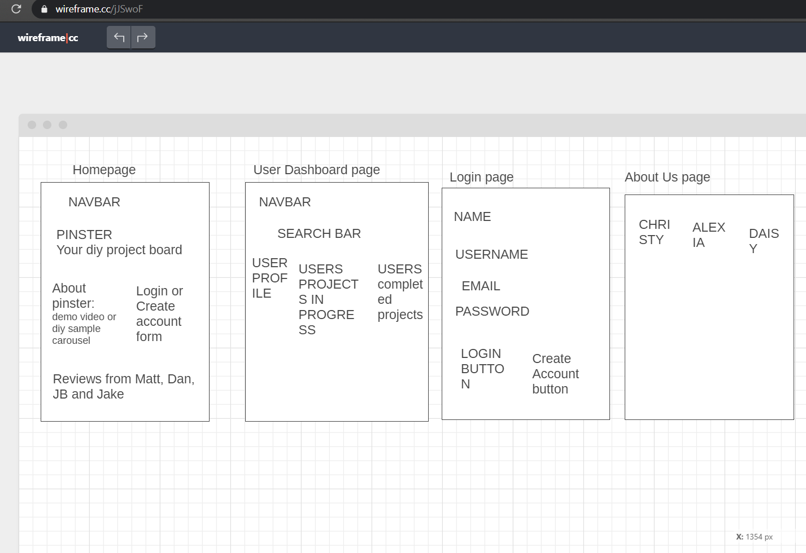
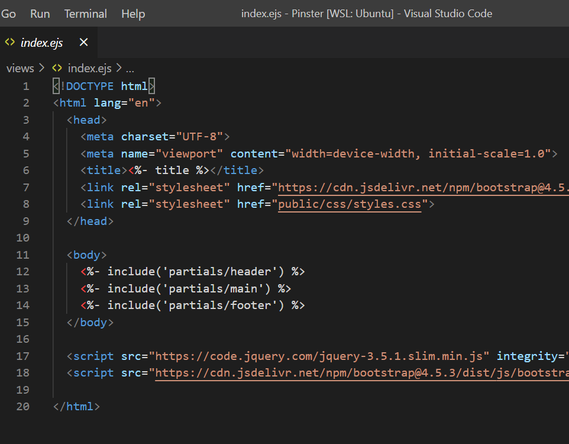
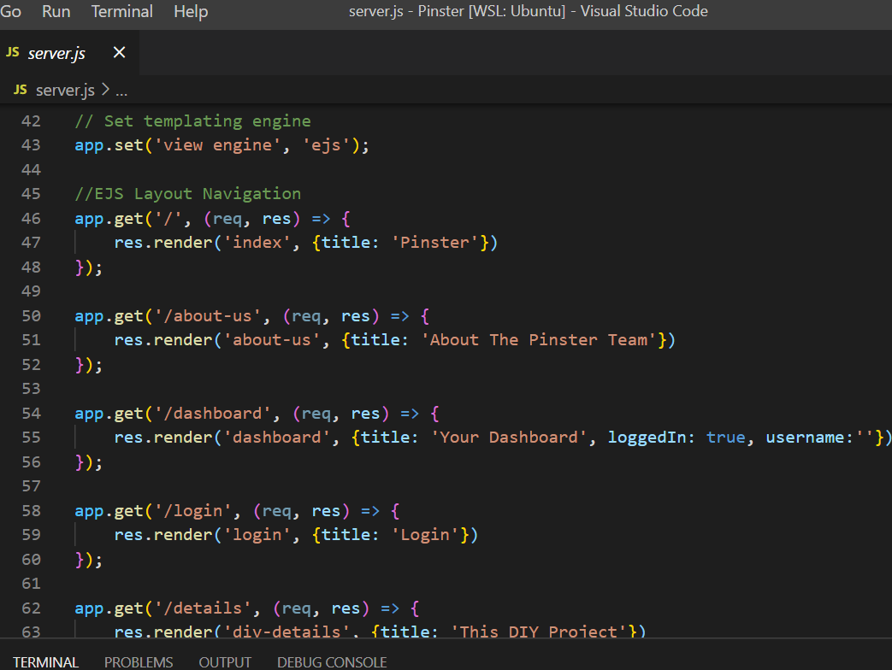

# Pinster  
```
Your DIY Project Board!
```
With Pinster you can search for a DIY project, pin it to your ongoing project board and mark it as complete when you're done!
> Hosted with heroku at: [Pinster](https://dc-pinster.herokuapp.com/)

## Technical Requirements
- Frontend:
    - HTML
    - CSS
    - Javascript
    - [Bootstrap](https://getbootstrap.com/docs/4.5/getting-started/introduction/)
- Backend:
    - [Node](https://nodejs.org/en/)
    - [Postgresql](https://www.postgresql.org/)
    - [Sequelize](https://sequelize.org/)
    - [Nodemon](https://nodemon.io/)
    - [Express](https://expressjs.com/)
    - [EJS](https://ejs.co/)
- OAuth:
    - [Passport.js](http://www.passportjs.org/docs/)
- API used:
    - [Tumblr](https://tumblr.github.io/tumblr.js/index.html)
- Other Resources:
    - [Wireframe](https://wireframe.cc/jJSwoF)

## Getting Started with Pinster
* Install node
- `npm install node `
* Install dependencies and devdependencies e.g express, nodemon
* Edit package.json
* Include a license
* Make file layout including gitignore and .env
* Start building!

## Project Highlights
We began our project by creating a wireframe for the project idea:

We then researched our api's and chose a templating engine.
Embedded Javascript(EJS) was our templating engine of choice, used to facilitate development and organize our code:
 
## Pinster Team
- [Christy](https://github.com/appletom)
- [Alexia](https://github.com/appletom)
- [Daisy](https://github.com/daisy-u)

## License
```
MIT
```
> Copyright &copy; Pinster, DigitalCrafts 2020.

